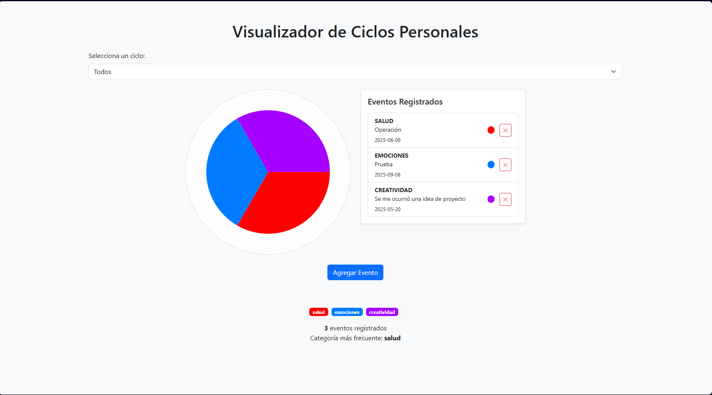

# 🔄 Visualizador de Ciclos Personales

> Aplicación interactiva para visualizar y registrar eventos personales dentro de distintos ciclos de vida como **salud**, **emociones** y **crecimiento personal**.

 <!-- Reemplaza con una captura si tienes -->

---

## 🧠 ¿Qué es esto?

Una herramienta visual y dinámica para registrar eventos personales y ver cómo se distribuyen dentro de ciclos que se repiten con el tiempo. Utiliza una interfaz moderna basada en Bootstrap y almacenamiento local (`localStorage`) para mantener tus datos seguros sin depender de servidores.

---

## ✨ Características Principales

| Funcionalidad        | Descripción                                                                 |
|----------------------|-----------------------------------------------------------------------------|
| 📅 **Registro de eventos** | Añade eventos con categoría, fecha y descripción.                            |
| 🎯 **Visualización cíclica** | Representación circular de los ciclos en colores.                          |
| 🎛️ **Filtrado por categoría** | Selecciona el tipo de ciclo para visualizar solo eventos relevantes.        |
| 🧾 **Sidebar interactivo** | Lista lateral con scroll de eventos registrados.                         |
| 🔍 **Modal de detalles**   | Al hacer clic en un evento, se despliega un modal con todos los datos.      |
| ❌ **Eliminación simple** | Elimina eventos directamente desde el panel con un solo clic.             |
| 💾 **Persistencia local** | Todos los datos se guardan en el navegador con `localStorage`.           |

---

## 🖼️ Interfaz de Usuario

### 🎡 Vista Principal

- Representación circular del ciclo activo.
- Color dinámico según la categoría de evento predominante.

### 📝 Sidebar de Eventos

- Lista de eventos scrollable.
- Botón para agregar nuevos eventos.
- Badge de color representativo de la categoría.

### 💬 Modal de Detalle

- Al hacer clic en un evento se despliega un modal con:
  - Categoría
  - Descripción completa
  - Fecha
  - Color asignado

---

## 🧩 Tecnologías Utilizadas

- 🔵 **HTML5**
- 🎨 **CSS3 / Bootstrap 5**
- ⚙️ **JavaScript**
- 🧠 **localStorage** para persistencia

---

## 🚀 Cómo ejecutar

1. Clona el repositorio:
   ```bash
   git clone https://github.com/tu-usuario/visualizador-ciclos.git
   cd visualizador-ciclos
